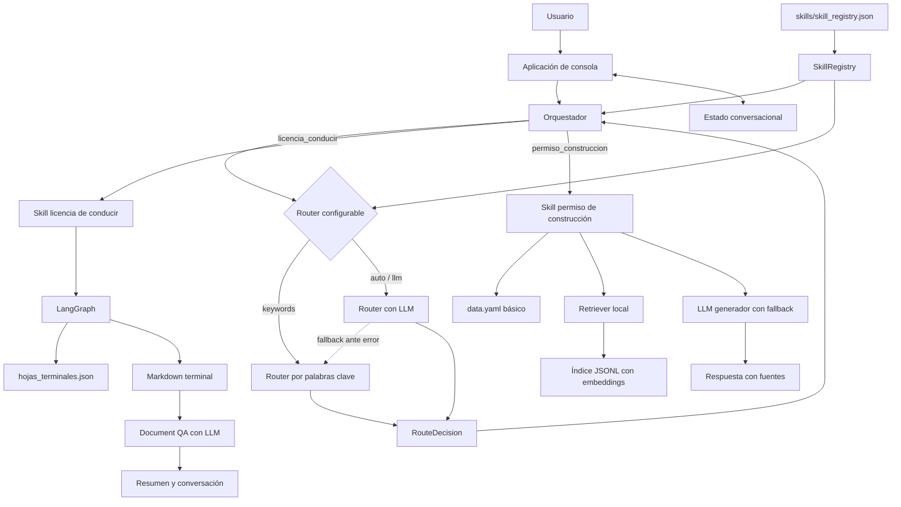
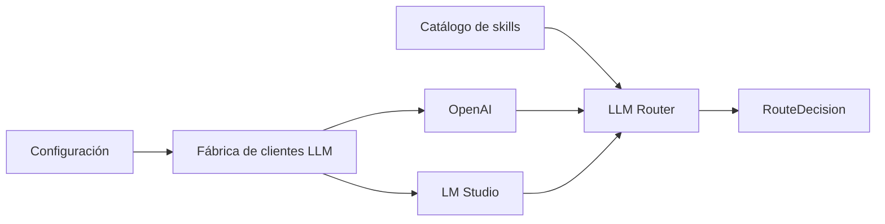
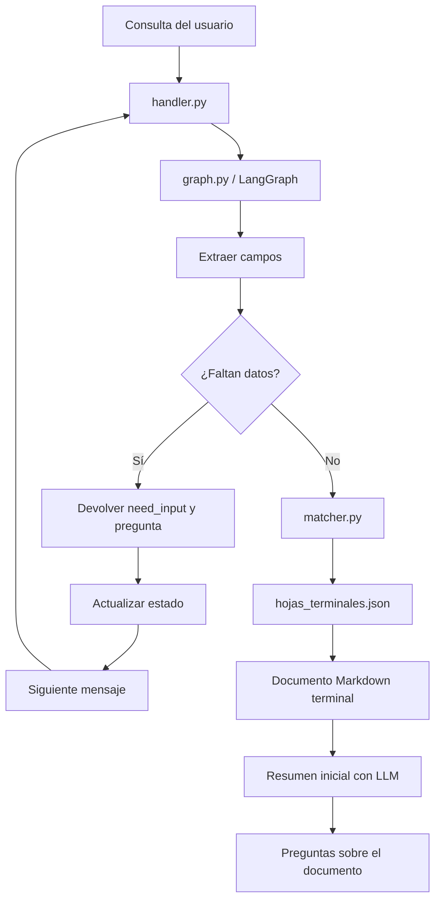
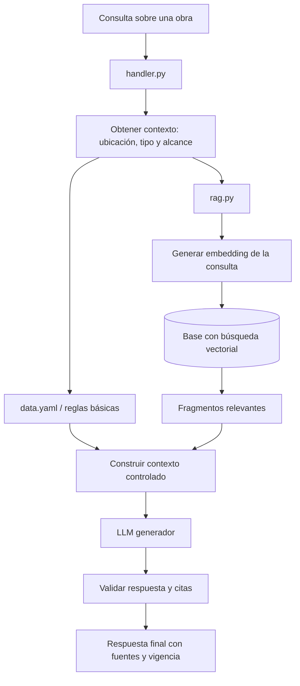
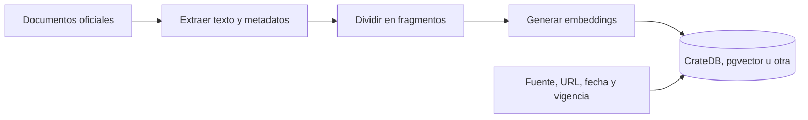
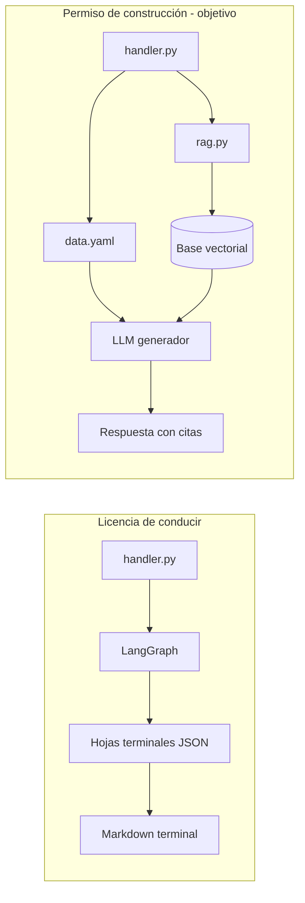

# Arquitectura de agentes y skills para trámites ciudadanos

## 1. Objetivo

Esta prueba de concepto explora una arquitectura extensible para atender
consultas sobre trámites ciudadanos.

El sistema recibe una consulta, identifica la necesidad, selecciona una skill especializada y delega en ella la conversación. Cada skill puede implementar una estrategia diferente según la complejidad del trámite:

- Reglas y datos estructurados para trámites previsibles.
- APIs para consultar sistemas transaccionales.
- RAG y un LLM para documentación extensa o normativa compleja.

La arquitectura busca que agregar una skill no requiera reescribir el
orquestador.

## 2. Vista general



Las líneas continuas representan componentes actuales. En permiso de
construcción, el RAG es todavía una prueba acotada a una muestra de ochavas,
no una cobertura completa del trámite.

## 3. Responsabilidades principales

### Aplicación

`app.py` implementa la interfaz de consola:

1. Recibe mensajes.
2. Mantiene la sesión.
3. Invoca al orquestador.
4. Presenta preguntas o respuestas.

Podría reemplazarse por Streamlit, una API web o un canal de mensajería sin
cambiar las skills.

### Estado conversacional

`state.py` conserva en memoria:

- Skill activa.
- Campos obtenidos durante la conversación.
- Historial de mensajes.

Ejemplo:

```json
{
  "active_skill": "licencia_conducir",
  "fields": {
    "tipo_tramite": "renovacion",
    "categoria": "A",
    "edad": 35
  }
}
```

En una solución real podría persistirse en Redis o en una base de datos.

### Catálogo y registro

`skills/skill_registry.json` es la fuente descriptiva común para descubrir y
seleccionar skills. Contiene:

- Nombre y descripción.
- Ejemplos de consultas.
- Cuándo usar la skill.
- Campos que puede extraer el router.
- Palabras clave para el router local.
- Ruta del handler ejecutable.

`skill_registry.py` carga el JSON, importa cada handler y entrega al
orquestador la implementación seleccionada.

Esta separación permite que el router local y el router con LLM consuman el
mismo catálogo.

### Orquestador

`orchestrator.py` coordina el flujo, pero no implementa la lógica particular
de un trámite:

1. Solicita al router una decisión.
2. Guarda la skill y los campos detectados.
3. Obtiene el handler desde `SkillRegistry`.
4. Ejecuta la skill.
5. Actualiza el estado.
6. Devuelve el resultado a la aplicación.

### Router

El router responde con un contrato común:

```json
{
  "skill": "licencia_conducir",
  "confidence": 0.92,
  "extracted_fields": {
    "tipo_tramite": "renovacion",
    "categoria": "A",
    "edad": null
  }
}
```

Actualmente existen tres modos:

- `keywords`: selección local mediante `palabras_clave`.
- `auto`: usa el proveedor LLM si su configuración está completa; de lo
  contrario usa keywords.
- `llm`: intenta usar OpenAI o LM Studio según `LLM_PROVIDER` y conserva el
  router local como fallback.

El router con LLM construye su prompt a partir de
`skills/skill_registry.json`. Por eso conoce las descripciones, ejemplos y
reglas de uso de todas las skills registradas.

La fábrica común construye un cliente compatible con OpenAI y selecciona el
modelo según el rol:

- `ROUTER_MODEL`: clasificación y extracción inicial.
- `DOCUMENT_MODEL`: resumen y preguntas sobre documentos terminales.

El proveedor puede cambiarse sin modificar el orquestador:



Ambos proveedores usan `chat.completions`. El router solicita una respuesta
JSON estructurada y la valida con Pydantic antes de producir `RouteDecision`.

## 4. Contrato de las skills

Cada skill expone:

```python
def handle(text: str, current_fields: dict[str, object]) -> dict:
    ...
```

Y devuelve:

```json
{
  "status": "need_input | final",
  "question": "Pregunta o null",
  "answer": "Respuesta o null",
  "state_updates": {}
}
```

El contrato permite que una skill sea determinista y otra use RAG, sin que el
orquestador necesite conocer esa diferencia.

## 5. Skill licencia de conducir

### Características

Es un trámite adecuado para una implementación conversacional estructurada:

- Tiene tipos conocidos: primera vez, renovación, duplicado y homologación.
- Sus casos están definidos como hojas terminales.
- LangGraph coordina extracción, decisión, preguntas y salida.
- El contenido exacto de cada resultado está en un Markdown terminal.

### Flujo



### Archivos

```text
skills/licencia_conducir/
├── skill.md
├── handler.py
├── graph.py
├── matcher.py
├── hojas_terminales.json
└── documentos_terminales/
    └── *.md
```

### Rol de las hojas y documentos terminales

`hojas_terminales.json` contiene las condiciones de selección y cada Markdown
contiene la información exacta de un resultado. Esto permite separar:

- Coordinación: `graph.py`.
- Reglas de matching: `matcher.py`.
- Condiciones: `hojas_terminales.json`.
- Contenido administrativo: `documentos_terminales/*.md`.
- Documentación técnica de la skill: `skill.md`.

Esta estrategia es trazable y fácil de probar. El LLM reformula el Markdown
sin decidir ni inventar la hoja aplicable.

La implementación actual mantiene una fase `document_qa`: conserva el
documento elegido y los últimos mensajes, y vuelve a enviar el Markdown
completo en cada consulta. Por el tamaño esperado de cada hoja no se utiliza
RAG.

## 6. Skill permiso de construcción

### Estado actual

La implementación actual ya no es sólo un placeholder de enrutamiento. Es una
prueba documental acotada a consultas sobre ochavas, basada en una muestra del
Volumen XV del Digesto Departamental.

```text
skills/permiso_construccion/
├── skill.md
├── handler.py                     # Coordina conversación y retrieval
├── retriever.py                   # Recupera artículos por embeddings
├── rag_answer.py                  # Genera respuesta con fuentes y fallback
├── data.yaml                      # Metadatos y mensajes base
├── documentos/
│   └── articulos_muestra_ochavas.json
├── index/
│   └── ochavas_embeddings.jsonl
└── ingesta/
    └── build_embeddings_index.py
```

La cobertura sigue siendo limitada: sólo contiene una muestra exploratoria de
ochavas. No debe interpretarse como una skill completa de permisos de
construcción.

### Arquitectura objetivo

Un permiso de construcción puede tener:

- Normativa extensa.
- Variaciones por ubicación y tipo de obra.
- Excepciones y disposiciones relacionadas.
- Formularios e instructivos.
- Cambios de vigencia.

En ese caso conviene combinar datos estructurados con RAG.



Una posible estructura futura sería:

```text
skills/permiso_construccion/
├── skill.md
├── handler.py          # Coordina reglas, RAG y respuesta
├── data.yaml           # Categorías y datos deterministas
├── rag.py              # Búsqueda y recuperación
├── prompts.py          # Instrucciones del LLM
├── schemas.py          # Contratos y validaciones
└── documents/          # Fuentes para el proceso de ingesta
    ├── normativa.pdf
    ├── requisitos.md
    ├── instructivo.pdf
    └── preguntas_frecuentes.html
```

La carpeta `documents/` puede ser sólo una fuente de ingesta. En producción,
los originales podrían estar en almacenamiento documental y la skill
consultaría la base vectorial, no necesariamente archivos locales.

## 7. Ingesta para RAG

La carga de documentos debe ocurrir fuera del flujo de conversación:



Metadatos recomendados por fragmento:

```json
{
  "skill": "permiso_construccion",
  "document_id": "ordenanza-123",
  "title": "Ordenanza de edificación",
  "source_url": "https://fuente-oficial/...",
  "effective_from": "2026-01-01",
  "effective_to": null,
  "section": "Artículo 14",
  "text": "Fragmento recuperable",
  "embedding": []
}
```

CrateDB puede ser una opción si la versión y configuración elegidas cubren las
necesidades de almacenamiento vectorial y similitud. Otras alternativas son
PostgreSQL con pgvector, Qdrant, Weaviate u OpenSearch.

La elección depende de:

- Volumen de documentos y consultas.
- Filtros por jurisdicción y vigencia.
- Operación e infraestructura existentes.
- Necesidad de búsqueda híbrida: texto más vectores.

## 8. YAML frente a RAG

No son alternativas excluyentes.

| Necesidad | Estrategia recomendada |
|---|---|
| Campos, categorías y requisitos simples | YAML o base relacional |
| Reglas exactas y validaciones | Código y datos estructurados |
| Normativa extensa | RAG |
| Excepciones explicadas en documentos | RAG con citas |
| Agenda, pagos o expedientes en tiempo real | API oficial |
| Respuesta redactada en lenguaje natural | LLM sobre contexto controlado |

Principio recomendado:

> Lo estructurable debe mantenerse estructurado. El RAG debe recuperar
> evidencia documental, no sustituir reglas deterministas.

## 9. Comparación de las dos skills



| Aspecto | Licencia de conducir | Permiso de construcción |
|---|---|---|
| Estado actual | Funcional en la PoC | RAG local experimental acotado a ochavas |
| Fuente principal | Hojas JSON + Markdown | Muestra JSON de artículos + índice JSONL |
| Conversación | Pregunta campos faltantes | Pide aclaración en consultas generales sobre ochavas |
| RAG | No necesario inicialmente | Implementado como prueba local sin base vectorial externa |
| Base vectorial | No necesaria | Archivo JSONL con embeddings |
| Uso de LLM interno | Opcional | Genera respuesta con fuentes y fallback a evidencia |
| Respuesta | Requisitos y pasos estructurados | Respuesta contextual sobre la muestra disponible |

## 10. Trazabilidad y control

El LLM no debería inventar requisitos. Una respuesta final debe distinguir:

- Datos estructurados utilizados.
- Documentos recuperados.
- Fuente oficial.
- Sección o artículo aplicable.
- Fecha de vigencia o última revisión.
- Advertencias cuando falte evidencia.

Para RAG, cada afirmación normativa relevante debería vincularse a un
fragmento recuperado. Si la búsqueda no encuentra evidencia suficiente, la
skill debe informarlo en lugar de completar la respuesta por conocimiento
general del modelo.

## 11. Evolución sugerida

1. Mantener el router por keywords como baseline y fallback.
2. Probar el router con LLM usando el catálogo actual.
3. Agregar tests de clasificación para evitar regresiones entre skills.
4. Definir campos conversacionales de permiso de construcción.
5. Reunir y versionar fuentes oficiales.
6. Crear un proceso de ingesta y una base vectorial de prueba.
7. Implementar recuperación con filtros de jurisdicción y vigencia.
8. Agregar generación con LLM y citas verificables.
9. Incorporar logging, métricas y evaluación de respuestas.
10. Conectar APIs oficiales cuando se necesiten datos en tiempo real.

## 12. Límite de la PoC actual

Actualmente están implementados:

- Catálogo JSON con dos skills.
- Registro dinámico de handlers.
- Router por palabras clave.
- Router configurable con OpenAI o LM Studio y fallback local.
- Estado conversacional en memoria.
- Skill funcional de licencia de conducir.
- Grafo LangGraph y ocho documentos terminales para licencia.
- Skill experimental de permiso de construcción acotada a ochavas.
- Muestra documental de artículos de ochavas.
- Índice local JSONL con embeddings para esa muestra.
- Retriever por similitud coseno.
- Generación RAG con fuentes y fallback a evidencia recuperada.

Todavía no están implementados:

- Router con un modelo local.
- RAG completo para permiso de construcción.
- Ingesta documental robusta y repetible desde fuentes oficiales.
- Base vectorial externa o persistencia especializada.
- Cobertura documental amplia de normativa de construcción.
- Validación exhaustiva de respuestas normativas con citas.
- Integraciones con APIs oficiales.
