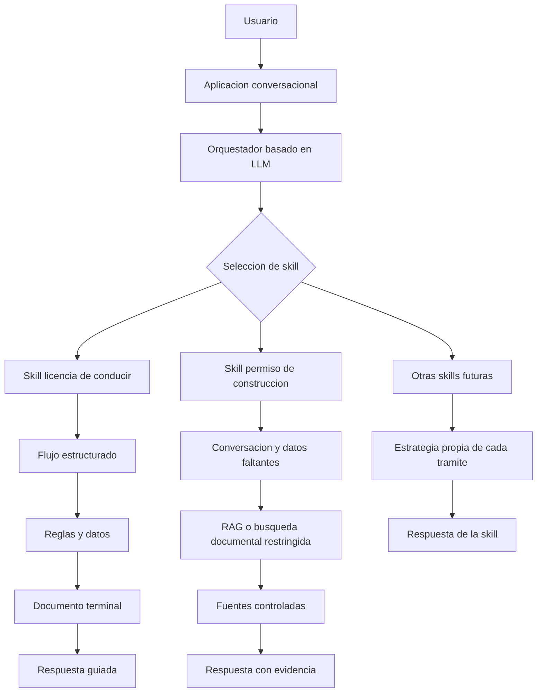

# Arquitectura conceptual de agentes por skills

## 1. Visión general

La propuesta consiste en construir una plataforma de asistencia para trámites
públicos basada en unidades independientes llamadas skills. Cada skill
representa un trámite o familia de trámites y encapsula su propia forma de
resolver consultas, guiar al usuario y recuperar información confiable.

La aplicación no se concibe como un único agente monolítico que conoce todos
los trámites, sino como un sistema modular donde un orquestador interpreta la
consulta del usuario y delega la conversación a la skill más adecuada.

Este enfoque permite incorporar nuevos trámites de forma progresiva, sin
reescribir la arquitectura general y sin forzar que todos los trámites se
resuelvan con la misma estrategia técnica.

## 2. Principio central: una skill por trámite

Cada trámite debe funcionar como una caja especializada. Dentro de esa caja se
encuentran las reglas, documentos, datos necesarios, validaciones y mecanismos
de respuesta propios de ese trámite.

Una skill puede contener:

- Reglas determinísticas.
- Datos estructurados en JSON, YAML u otro formato declarativo.
- Flujos conversacionales.
- Documentos explicativos.
- Búsqueda documental.
- RAG.
- Integraciones con APIs.
- Validaciones contra sistemas externos.

La arquitectura debe permitir que cada skill evolucione de forma independiente.
Una mejora en un trámite no debería afectar la lógica interna de otros
trámites.

La unidad funcional de la plataforma no es el agente completo, sino la skill de
trámite. Cada skill encapsula el conocimiento y la estrategia necesaria para
asistir a la ciudadanía en un dominio concreto.

## 3. Orquestador conversacional

El orquestador es la capa encargada de recibir la interacción del usuario,
interpretar la intención y seleccionar la skill correspondiente.

Su responsabilidad principal es decidir a qué caja delegar la consulta, no
resolver por sí mismo todos los trámites.

El orquestador puede apoyarse en un LLM para:

- Comprender consultas formuladas en lenguaje natural.
- Reconocer distintas formas de referirse al mismo trámite.
- Extraer información inicial útil para la skill.
- Mantener el contexto conversacional.
- Delegar a la skill más adecuada según la necesidad detectada.

Por ejemplo, expresiones como "quiero sacar la libreta", "perdí mi licencia" o
"tengo que renovar el registro" pueden referirse al mismo dominio de trámite,
aunque no usen exactamente las palabras oficiales.

El LLM del orquestador no debería ser la fuente de verdad normativa. Su rol es
interpretar, clasificar y encaminar. La lógica específica y las fuentes de
respuesta deben quedar dentro de la skill seleccionada.

## 4. Skills como unidades autónomas

Cada skill puede ser tan simple o compleja como lo requiera el trámite.

No todos los trámites tienen la misma estructura. Algunos pueden resolverse con
un flujo claro de preguntas y respuestas. Otros pueden requerir recuperación de
documentos, búsqueda semántica, validaciones externas o razonamiento sobre
normativa extensa.

Por eso, la arquitectura no impone una única solución interna para todas las
skills. Lo importante es que cada skill respete un contrato común hacia el
orquestador: recibir una consulta con contexto y devolver una pregunta, una
respuesta o una actualización del estado conversacional.

Internamente, una skill podría implementar estrategias como:

- Árboles de decisión.
- Flujos con estados explícitos.
- Selección de documentos terminales.
- RAG sobre documentos acotados.
- Consultas a APIs oficiales.
- Combinaciones de reglas estructuradas y generación con LLM.

Este desacople permite que el sistema crezca por trámite y no por acumulación
de condiciones rígidas en un único flujo central.

## 5. Ejemplo de skill estructurada: licencia de conducir

Licencia de conducir representa un caso adecuado para una skill estructurada.

En este tipo de trámite suele ser posible identificar:

- Tipos de solicitud relativamente claros.
- Datos necesarios para orientar la respuesta.
- Combinaciones de condiciones que llevan a un resultado concreto.
- Textos explicativos terminales para comunicar requisitos, pasos y
  advertencias.

En una implementación de este tipo, la skill puede guiar al usuario mediante
preguntas, completar los datos faltantes, seleccionar una hoja terminal y
responder usando documentación previamente controlada.

El LLM puede utilizarse para redactar una respuesta clara y conversacional,
pero no para decidir libremente los requisitos. La decisión debe apoyarse en
reglas, datos estructurados y documentos definidos por la skill.

Este patrón es útil cuando el trámite puede modelarse como un recorrido
conversacional con salidas conocidas.

## 6. Ejemplo de skill documental o compleja: permiso de construcción

Permiso de construcción representa un caso potencialmente distinto.

Este tipo de trámite puede depender de múltiples factores:

- Ubicación.
- Tipo de obra.
- Alcance de la intervención.
- Normativa aplicable.
- Excepciones.
- Vigencia de disposiciones.
- Formularios o instructivos específicos.

En un caso así, puede no alcanzar con un árbol de decisión simple. La skill
podría requerir una estrategia documental, por ejemplo RAG, combinada con
preguntas aclaratorias y reglas estructuradas.

Una skill de este tipo debería poder detectar si cuenta con información
suficiente para responder. Si faltan datos relevantes, debería pedirlos antes
de generar una respuesta. Si la evidencia documental recuperada no alcanza,
debería explicitarlo en lugar de completar la respuesta con conocimiento
general del modelo.

La arquitectura debe permitir evaluar distintas estrategias para cada trámite:
un flujo conversacional estructurado, un RAG restringido, una consulta a una
API, o una combinación de esos mecanismos.

## 7. Guía activa al usuario

El objetivo de la aplicación no es solamente responder preguntas, sino guiar al
usuario hacia una respuesta útil y accionable.

Para eso, las skills deberían:

- Identificar información faltante.
- Hacer preguntas concretas.
- Evitar respuestas demasiado generales cuando el caso requiere datos
  específicos.
- Mantener el contexto de la conversación.
- Traducir reglas o documentos administrativos a lenguaje claro.
- Indicar límites cuando la información disponible no sea suficiente.

La experiencia buscada es la de un asistente que acompaña el trámite y reduce
la incertidumbre del ciudadano, no la de un buscador documental abierto.

## 8. Control de información y reducción de alucinaciones

Un principio central de la arquitectura es restringir el universo de
información consultable antes de generar una respuesta.

El LLM no debe operar sobre conocimiento general cuando responde sobre
requisitos, normativa o pasos administrativos. Debe trabajar sobre información
acotada, validada y asociada a la skill correspondiente.

Para reducir alucinaciones y respuestas erróneas, la arquitectura debería
favorecer:

- Seleccionar primero la skill antes de consultar documentos.
- Consultar solo fuentes asociadas al trámite seleccionado.
- Mantener documentos y datos por skill.
- Usar reglas determinísticas cuando el trámite lo permita.
- Usar RAG solo sobre corpus documentales controlados.
- Solicitar más información cuando el caso no esté suficientemente definido.
- Responder con advertencias cuando no exista evidencia suficiente.
- Conservar trazabilidad entre respuesta y fuente consultada.

El LLM debe funcionar como una interfaz de interpretación, recuperación y
redacción sobre información controlada, no como fuente primaria de verdad.

## 9. Arquitectura conceptual

El orquestador decide la skill. La skill decide cómo resolver la consulta.
Cada trámite puede tener una implementación interna distinta, siempre dentro
de un contrato común hacia la aplicación.

## 10. Principios de diseño

La arquitectura debería sostener los siguientes principios:

- Modularidad: cada trámite se implementa como una skill independiente.
- Delegación: el orquestador enruta, la skill resuelve.
- Complejidad proporcional: cada trámite usa la estrategia que necesita.
- Trazabilidad: las respuestas deben poder vincularse con reglas, datos o
  fuentes.
- Conocimiento acotado: cada skill consulta solo su propio universo de
  información.
- Guía conversacional: el sistema debe pedir datos cuando sean necesarios.
- Mantenibilidad: agregar o modificar una skill no debe romper las demás.
- Simplicidad inicial: preferir reglas y datos estructurados cuando sean
  suficientes.

## 11. Líneas de evaluación futura

A medida que se incorporen nuevos trámites, será necesario evaluar:

- Qué trámites pueden resolverse con flujos estructurados.
- Qué trámites requieren RAG u otras formas de recuperación documental.
- Cómo detectar información faltante antes de responder.
- Cómo versionar documentos y vigencias.
- Cómo citar o referenciar fuentes oficiales.
- Cómo medir calidad, precisión y utilidad de las respuestas.
- Cómo integrar sistemas externos cuando existan datos transaccionales.

Estas decisiones deberían tomarse por trámite, no de forma general para toda la
plataforma.

## 12. Estado actual de la PoC

La PoC actual valida una primera versión de esta idea:

- Existe un orquestador que recibe consultas y delega en skills.
- Existe un catálogo de skills.
- Licencia de conducir funciona como ejemplo de skill estructurada.
- Permiso de construcción existe como punto de partida para evaluar una skill
  más documental o compleja.
- El router puede funcionar con reglas locales o apoyarse en un LLM con
  fallback.

El foco de las siguientes iteraciones debería estar en consolidar el patrón de
skills, mejorar la experiencia de guía al usuario y evaluar qué estrategia
interna corresponde a cada nuevo trámite.
