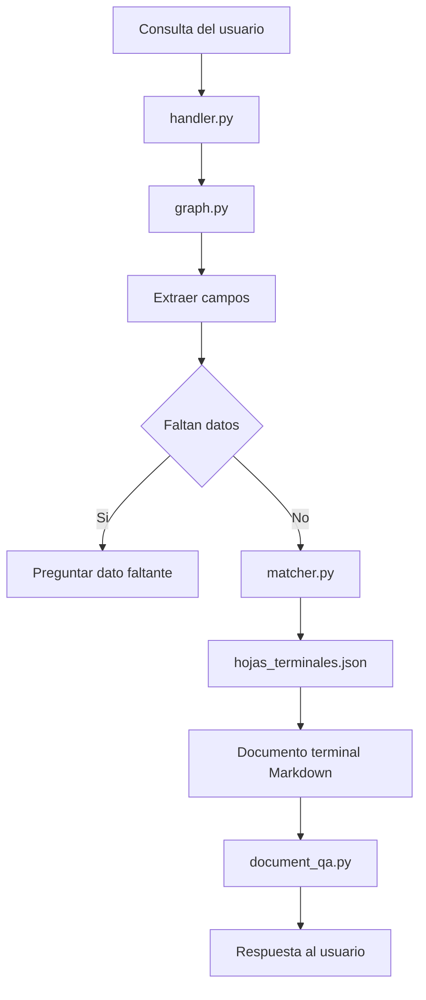

# Arquitectura de la skill licencia de conducir

## 1. Objetivo

La skill `licencia_conducir` atiende consultas sobre trámites vinculados a la
licencia de conducir, como primera licencia, renovación, duplicado y
homologación.

Esta skill representa un caso de trámite estructurado: existen tipos de
solicitud identificables, datos concretos que deben obtenerse del usuario y
respuestas terminales previamente documentadas.

## 2. Enfoque de diseño

El diseño se basa en guiar al usuario por un flujo conversacional hasta llegar
a una hoja terminal.

La lógica principal no depende de que el LLM invente requisitos. La skill usa:

- Extracción de campos desde la conversación.
- Estado explícito.
- Reglas de selección.
- Hojas terminales en JSON.
- Documentos Markdown con el contenido final de cada caso.

El LLM puede ayudar a redactar una respuesta clara o responder preguntas sobre
el documento terminal, pero la decisión del caso aplicable se apoya en reglas y
datos controlados.

## 3. Flujo interno

## 4. Componentes

- `handler.py`: adapta la skill al contrato general usado por el orquestador.
- `graph.py`: coordina el flujo conversacional mediante LangGraph.
- `matcher.py`: compara los campos obtenidos contra las hojas terminales.
- `hojas_terminales.json`: define condiciones y documentos asociados.
- `documentos_terminales/`: contiene los textos finales para cada caso.
- `document_qa.py`: resume y responde preguntas usando el Markdown terminal.

## 5. Datos conversacionales

La skill busca completar los datos necesarios para seleccionar una hoja
terminal. Los campos pueden provenir de:

- La consulta inicial del usuario.
- Mensajes posteriores.
- Campos detectados por el router.
- Preguntas realizadas por la propia skill.

Si falta información, la skill debe preguntar antes de responder.

## 6. Fuentes de verdad

Las fuentes internas de esta skill son:

- `hojas_terminales.json` para decidir el caso aplicable.
- `documentos_terminales/*.md` para generar la respuesta final.

La respuesta no debe basarse en conocimiento general del modelo cuando se
trate de requisitos, pasos o condiciones del trámite.

## 7. Control de alucinaciones

La estrategia de control es restringir el espacio de decisión:

- Las combinaciones válidas están modeladas como hojas terminales.
- Cada hoja apunta a un documento concreto.
- El LLM trabaja sobre el documento terminal completo.
- Si una combinación no está cubierta, la skill debe indicarlo de forma
  explícita.

En este caso no se considera necesario usar RAG inicialmente, porque los
documentos terminales son acotados y el flujo puede resolverse con reglas.

## 8. Límites actuales

- La cobertura depende de las hojas terminales ya cargadas.
- No consulta APIs oficiales.
- No agenda turnos ni verifica disponibilidad.
- No valida identidad ni datos personales.
- No reemplaza la confirmación contra fuentes oficiales vigentes.

## 9. Evolución posible

Posibles mejoras futuras:

- Ampliar hojas terminales.
- Agregar más pruebas de conversación.
- Versionar fuentes oficiales y fechas de vigencia.
- Mejorar la extracción de campos.
- Incorporar confirmaciones más amigables para el usuario.
- Integrar sistemas oficiales si se requiere agenda, pagos o estado de trámite.
