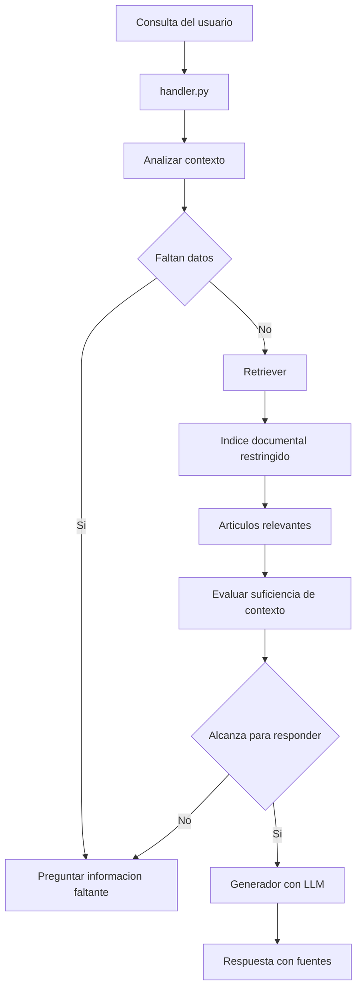

# Arquitectura de la skill permiso de construcción

## 1. Objetivo

La skill `permiso_construccion` busca atender consultas sobre permisos para
construir, ampliar, reformar o regularizar obras.

A diferencia de licencia de conducir, este trámite puede requerir una estrategia
más documental y contextual. La respuesta puede depender de normativa extensa,
ubicación, tipo de obra, alcance de la intervención, excepciones y vigencia de
las disposiciones.

## 2. Enfoque de diseño

Esta skill debe poder evolucionar como una caja con lógica propia. No se asume
que todo el trámite pueda resolverse con un árbol simple de decisión.

La estrategia a evaluar combina:

- Preguntas conversacionales para obtener datos faltantes.
- Documentos normativos acotados por sección o tema.
- Recuperación de información relevante.
- Posible RAG sobre corpus controlado.
- Evaluación de suficiencia de contexto antes de responder.
- Respuestas con trazabilidad a artículos o fuentes.

El objetivo no es abrir un chat general sobre normativa, sino guiar al usuario
hacia una respuesta clara usando fuentes restringidas y verificables.

La skill no debería comportarse como un buscador que siempre devuelve una
respuesta luego del retrieval. Si los artículos recuperados muestran que la
pregunta puede depender de varios escenarios, la skill debe pedir una aclaración
antes de generar una respuesta específica.

## 3. Estado actual

Actualmente la skill funciona como placeholder:

- El orquestador puede seleccionarla.
- Devuelve una respuesta fija.
- No consulta normativa real.
- No implementa RAG.
- No solicita datos adicionales.

Como primera exploración documental se generó una muestra del Capítulo I "De
las ochavas" del Volumen XV del Digesto Departamental.

## 4. Fuente exploratoria inicial

Fuente evaluada:

```text
https://normativa.montevideo.gub.uy/armado/82663
```

La página corresponde al armado del Volumen XV y contiene una estructura HTML
con:

- Jerarquía normativa.
- Artículos.
- Estado del texto.
- Cuerpo del artículo.
- Fuentes normativas.

La muestra generada quedó en:

```text
skills/permiso_construccion/documentos/articulos_muestra_ochavas.json
```

## 5. Estructura documental propuesta

Cada artículo extraído debería representarse con metadatos suficientes para
recuperación, trazabilidad y respuesta:

```json
{
  "id": "articulo_81743",
  "node_id": "81743",
  "numero": "D.3186",
  "estado": "vigente",
  "texto": "...",
  "url": "https://normativa.montevideo.gub.uy/articulo/81743",
  "fuente_armado": "https://normativa.montevideo.gub.uy/armado/82663",
  "jerarquia": {
    "volumen": "Volumen XV Planeamiento de la Edificación",
    "parte": "Parte Legislativa",
    "libro": "Libro XV Planeamiento de la Edificación",
    "titulo": "Título I Normas generales para proyecto",
    "capitulo": "Capítulo I De las ochavas",
    "seccion": null
  },
  "fuentes": [],
  "fecha_consulta": "2026-06-24"
}
```

## 6. Flujo objetivo



## 7. Datos que puede necesitar pedir

Según el tipo de consulta, la skill podría necesitar:

- Ubicación o zona.
- Tipo de obra.
- Si es obra nueva, ampliación, reforma o regularización.
- Destino del inmueble.
- Escala o metraje aproximado.
- Si la consulta refiere a un requisito, una restricción o una excepción.

La skill no debería consultar el RAG como único paso. Antes y después del
retrieval debería evaluar si la pregunta tiene contexto suficiente para generar
una respuesta útil.

Por ejemplo, una consulta como "tengo que poner ochavas" puede requerir
aclarar si se trata de una esquina existente, un nuevo trazado, una situación
fuera de centros urbanos o un caso con ángulo agudo u obtuso. En ese caso, la
skill debería preguntar antes de dar una respuesta normativa cerrada.

## 8. Estrategia RAG propuesta

Para una primera PoC, la estrategia debería ser simple:

1. Ingestar una sección acotada.
2. Guardar artículos normalizados en JSON.
3. Generar embeddings por artículo o fragmento.
4. Buscar por similitud sobre ese índice.
5. Evaluar si la consulta tiene contexto suficiente.
6. Si falta contexto, realizar una pregunta aclaratoria.
7. Si alcanza, responder sólo con los fragmentos recuperados.
8. Citar artículos y URL.

No se recomienda comenzar con una base vectorial compleja. Primero conviene
validar si la recuperación trae evidencia útil y si las respuestas resultan
controlables.

## 9. Evaluación de contexto

La skill debería incorporar una etapa de evaluación entre el retrieval y la
respuesta final.

Esa etapa puede comenzar con reglas simples y luego apoyarse en un LLM con
salida estructurada.

Ejemplo de contrato esperado:

```json
{
  "status": "need_input",
  "missing_context": ["tipo_de_situacion"],
  "question": "¿Se trata de una esquina existente, un nuevo trazado o un caso con ángulo agudo u obtuso?",
  "reason": "Los artículos recuperados regulan situaciones distintas."
}
```

Cuando la evaluación indique que la evidencia alcanza, la skill puede continuar
con generación de respuesta. Cuando indique que falta información, debe
preguntar y conservar el tema en el estado conversacional.

## 10. Estado conversacional interno

La skill debería conservar contexto temporal propio, por ejemplo:

```json
{
  "tema": "ochavas",
  "ultima_consulta": "tengo que poner ochavas",
  "contexto_pendiente": ["tipo_de_situacion"]
}
```

Este estado permite que una pregunta posterior como "¿y cuál es la dimensión
mínima?" pueda interpretarse dentro del tema activo.

El estado debe reemplazarse si el usuario cambia de tema y limpiarse cuando la
conversación se finaliza o comienza una nueva consulta.

## 11. Control de alucinaciones

La skill debe reducir el riesgo de respuestas erróneas mediante:

- Corpus documental restringido.
- Filtro por estado vigente.
- Metadatos de jerarquía normativa.
- Citas a artículos recuperados.
- Evaluación explícita de suficiencia de contexto.
- Advertencias cuando no haya evidencia suficiente.
- Preguntas aclaratorias antes de responder si el caso está incompleto.

El LLM no debe completar requisitos desde conocimiento general. Debe redactar
únicamente a partir de documentos recuperados y datos explícitos del usuario.
Si faltan datos para elegir entre escenarios normativos, debe pedirlos.

## 12. Límites actuales

- La muestra contiene sólo un capítulo.
- No existe aún índice vectorial.
- No hay embeddings generados.
- No hay retriever implementado.
- No hay generación RAG conectada al handler.
- El scraping actual fue exploratorio y no un proceso de ingesta robusto.

## 13. Evolución posible

Próximos pasos técnicos:

- Definir la sección normativa inicial para el primer RAG funcional.
- Implementar un scraper mantenible.
- Evaluar incorporar `beautifulsoup4` para parseo HTML robusto.
- Normalizar artículos y metadatos.
- Crear un índice vectorial simple en archivos.
- Implementar un retriever con similitud coseno.
- Implementar evaluación de contexto antes de responder.
- Diseñar prompts que obliguen a responder con fuentes.
- Agregar tests de recuperación y de ausencia de evidencia.
